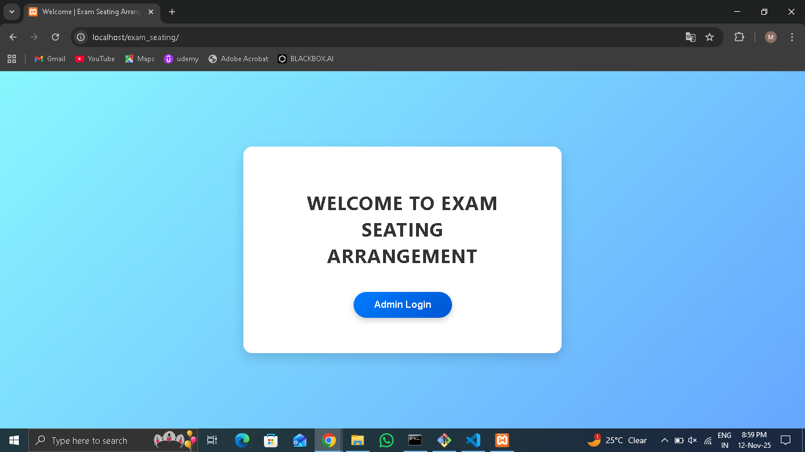
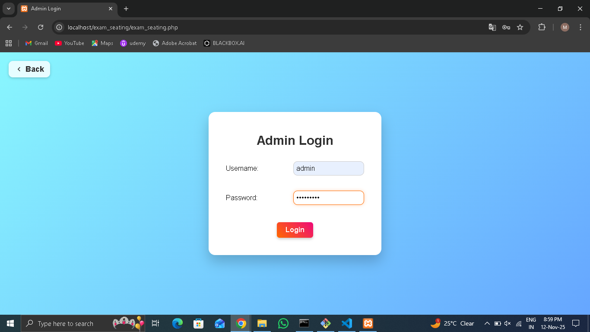
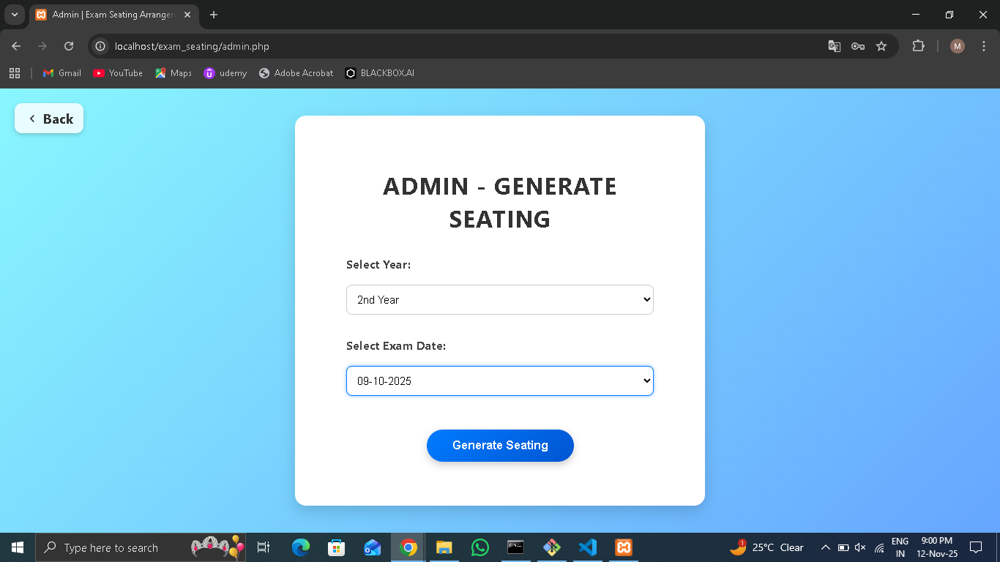
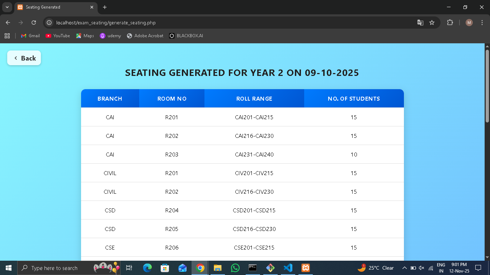
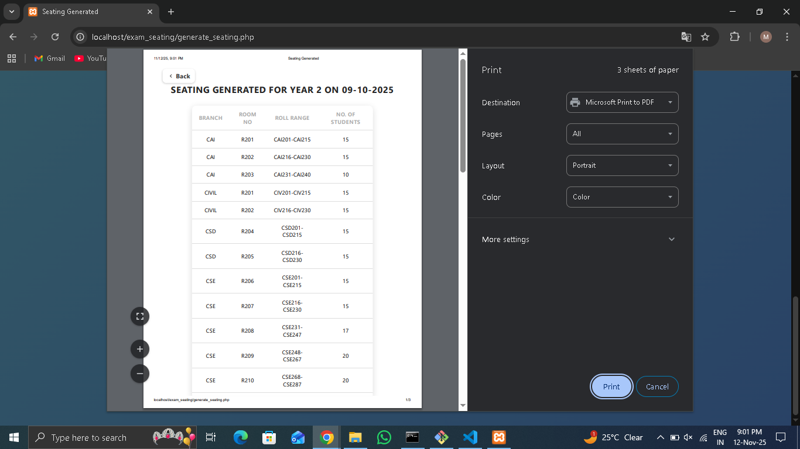

#  Exam Seating Arrangement System

A web-based application built to simplify and automate the process of assigning seats to students during examinations.  
This project ensures efficient management of exam halls, seating plans, and student data using **PHP**, **MySQL**, **HTML**, **CSS**, and **JavaScript**.

---

## Features

-  **Dynamic Seat Allocation** — Automatically generates seating based on the number of students and rooms.
-  **Room & Student Management** — Admins can easily add, edit, or remove student and room data.
-  **Printable Seating Plan** — Generates an organized seating layout for offline reference.
-  **Admin Authentication** — Secure login system for exam coordinators.
-  **User-Friendly Interface** — Simple and responsive front-end design.

---

##  Tech Stack

| Category | Technology |
|-----------|-------------|
| Frontend  | HTML, CSS, JavaScript, Bootstrap |
| Backend   | PHP (Core PHP) |
| Database  | MySQL |
| Server    | XAMPP / Apache |
| Version Control | Git & GitHub |

---

##  Installation & Setup

1. **Clone the repository**
   ```bash
   git clone https://github.com/MdAyesha-28/Exam-Seating-Arrangement.git 
---

##  Screenshots

### Index


###  Admin Login


### Exam Seating Selection


###  Generated Seating

###  Print Generated Seating

